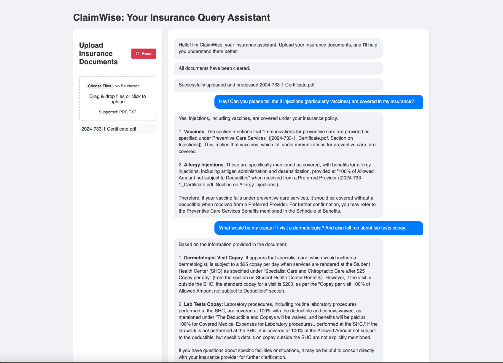
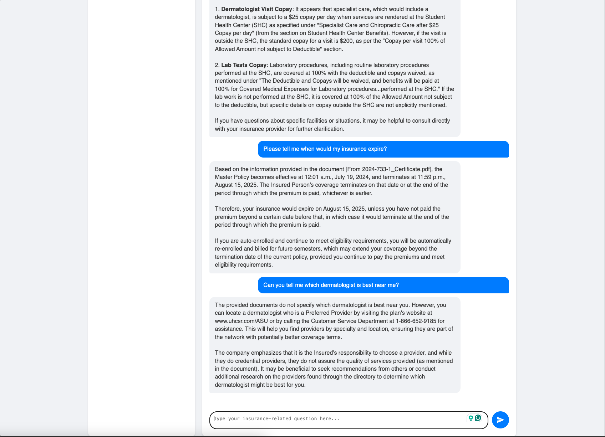

# ClaimWise: Insurance Document Assistant

## About The Project

ClaimWise is an intelligent document processing and query system designed specifically for insurance documents. It allows users to upload insurance-related documents (PDF, TXT) and ask questions about their contents using natural language. The system uses advanced AI to provide accurate, context-aware responses based on the uploaded documents.

Key features:
- Document upload with drag-and-drop support
- Real-time document processing
- AI-powered question answering
- Semantic search capabilities
- Support for multiple document formats (PDF, TXT)
- Clean, modern user interface





## Built With

* Frontend:
  - HTML5
  - CSS3
  - Vanilla JavaScript

* Backend:
  - [Flask](https://flask.palletsprojects.com/) - Python web framework
  - [OpenAI API](https://openai.com/api/) - For LLM-powered responses and generating embeddings from text chunks.
  - [Elasticsearch](https://www.elastic.co/) - For document indexing and semantic search
  - [NLTK](https://www.nltk.org/) - For text processing
  - [PyPDF2](https://pypdf2.readthedocs.io/) - For PDF processing

## Getting Started

### Prerequisites

- Python 3.8 or higher
- Elasticsearch 8.x
- OpenAI API key

### Installation

1. Clone the repository
   ```sh
   git clone https://github.com/deeprodge/claimwise.git
   cd claimwise
   ```

2. Create and activate a virtual environment
   ```sh
   python -m venv venv
   source venv/bin/activate  # On Windows: venv\Scripts\activate
   ```

3. Install required packages
   ```sh
   pip install -r requirements.txt
   ```

4. Set up environment variables
   Create a `.env` file in the root directory with:
   ```
   OPENAI_API_KEY=your_openai_api_key
   ELASTICSEARCH_URL=https://localhost:9200
   ELASTICSEARCH_USER=elastic
   ELASTICSEARCH_PASSWORD=your_elasticsearch_password
   ```

5. Start Elasticsearch
   Ensure Elasticsearch is running on your system (default port: 9200)

6. Run the application
   ```sh
   python app.py
   ```

7. Open your browser and navigate to `http://localhost:5000`

### Usage

1. Upload Documents:
   - Drag and drop insurance documents onto the upload area
   - Or click to select files from your computer
   - Supported formats: PDF, TXT

2. Ask Questions:
   - Type your insurance-related questions in the chat interface
   - Get AI-powered responses based on your uploaded documents
   - View source references for each answer

3. Reset Documents:
   - Use the reset button to clear all uploaded documents
   - This will remove both local files and indexed content

## License

Distributed under the MIT License. See `LICENSE` for more information.

## Contact

Deep Rodge - [@deeprodge](https://linkedin.com/in/deeprodge) - deeprodge14@gmail.com

Project Link: [https://github.com/deeprodge/claimwise](https://github.com/deeprodge/claimwise) 

